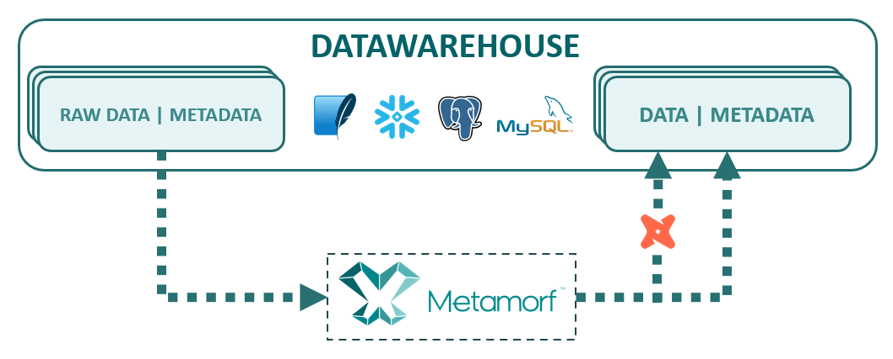

  

## What is Metamorf

Metamorf is a Metadata Suite that generates SQL code within a framework based on *select* statements.
Those queries are generated based on metadata that the user has entered on the framework.
All this metadata needs to be processed to maximize its potential. Metamorf can execute and materialize
these datasets, control the lineage end to end, even deploy an api sharing all the metadata.

## Architecture

  

Metamorf is a Python Software that orchestrates, controls and transforms data. From a 
metadata entry, Metamorf process the metadata to full its system and in exchange grants a series
of functionalities that allows to control all your datawarehouse.

Metamorf works with the concept of *owner*: it can be a user or a use case. Some actions of metamorf
can be done selecting an owner, indicated  on the configuration file.
It can be useful for teamwork using the same Metadata Database and isolating each user or use case
under development. Is up to you.

Metamorf stores all the metadata historically, it means that the users can see the status of their
datawarehouse in the past at any time and know how the data was processed.

### Databases

Actually Metamorf supports the following databases:
- Snowflake
- SQLite
- PostgreSQL
- MySQL

## How to Start
To install Metamorf, you need Python 3.10, and you can install it using pip. 
    
    pip install metamorf

Once installed, you can see all the available commands typing:

    metamorf help

For a quick start, create a directory where you want to locate all the configuration files.

    metamorf init

At this point, you have initialized your environment to configure Metamorf. The default configuration is through
a SQLite database.
  
Metamorf can be deployed where the configuration file says. If SQLite is selected (as default)
and it doesn't exist, Metamorf will create the databases. Try it!

    metamorf deploy

Now you have on your repository all the configuration files and a data and metadata example databases.  
To deploy an example on both databases, just type:

    metamorf deploy-example

A fake dataset is deployed on the data database, and a metadata entry is inserted on the metadata database.
You can just watch all these things with any Database Tool as DBeaver.  
  
If you want to process these metadata, try the command:

    metamorf process

Now all the metadata is processed and the main tables of Metamorf are populated.
To see if all works, you can just type any of the features that Metamorf offers:

If you want to run the processes indicated on the metadata to transform all the fake data, you can just type:

    metadata run

Probably you just want the SQL Files to execute from other platforms, type then:

    metadata output

The results are located on the output folder on your repository.  

The configuration file permits you to configure Metamorf to adapt it to your needs.
For example, one interesting option could be to generate all your datasets on *dbt* format.
To achieve it, just change your *configuration.yml* file, **output** option, **type** value to **dbt**.

      output:
        type: dbt

You can execute again 
    
    metadata output

And now you have all the necessary files for your dbt project.  

This tutorial is just a small demonstration about metamorf and its potential.

*Note: Metamorf works on Windows OS and Linux (tested on Ubuntu)*

## Commands

Metamorf works with commands as:

    metamorf [command] [arguments]

It accepts the commands showed in this section. Some of these commands accept arguments 
to select some datasets / files or an owner.

Arguments to specify the file or the target table:

    --select name_of_the_selection
    -s name_of_the_selection

Arguments to specify the owner:

    --owner target_owner_name
    -o target_owner_name

- **help**: it shows all the commands available
- **manifest**: it generates a manifest json file with all the dataset information. It will be used in future features.
- **api**: it deploys an api that serve all the dataset information.
- **validate**: it validates the configuration file.
- **init**: It creates the necessary folders, configuration file and other elements to execute metamorf on the current path. 
The user can specify the target databases type (data and metadata) with the arguments [-d/--database, -m/--metadata]1 
- **deploy**: It deploys Metamorf on the metadata database indicated on the configuration file.
- **deploy-example**: It deploys an example on both databases.
- **download**: It downloads all the metadata entry to the entry folder. It can be indicated the owner and the tables.
- **upload**: It uploads the metadata entry from the entry folder to the metadata database.
- **commit**: It commits the metadata entry from the actual owner. It can be useful to save gold versions and develop new datasets without any risk.
- **recover**: It recovers the last commit from the actual owner.
- **output**: It generates all the dataset files on the *output* folder.
- **delete**: It deletes all the metadata from the metadata entry.
- **backup**: It downloads a backup from all the system.
- **restore**: It uploads all the backup to the system.
- **files**: Upload all the files indicated on the metadata.
- **metadata**: Validates the Metadata Entry.

1 Actually Metamorf accepts the databases indicated on this [section](#Databases)

## Version Features

### 0.5.1
- (Bugfix) *dbt output* fixed.

### 0.5.0 
- (Feature) New example based on datavault modelling.
- (Feature) Validations for metadata.
- (Feature) Creation of schemas and databases if needed.
- (Feature) Add new columns if needed.
- (Feature) Select process to execute with dependencies if needed.
- (Feature) Configuration hashes for Datavault module.
- (Feature) Execution with threads.
- (Feature) Primary Key on create table.
- (Feature) Delete, Update, Merge strategies.
- (Bugfix) Fixed some small bugs.

### 0.4.4.2
- (Bugfix) Execute any commands without any config file.
- (Bugfix) Errors on NULL or None values on metadata entry.
- (Bugfix) Errors on column detection on complex mappings.
- (Bugfix) 'Files' command not using the correct target path connection.
- (Bugfix) Error on historical metadata when delete some entities in special casuistics.
- (Feature) Added 'if is null' logic on all hashes.
- (Feature) The user can change column names on Datavault Engine - Mappings.
- (Feature) Added duplicate control on Datavault Engine - Satellites.

### 0.4.4.1
- (Feature) **Datavault** module to speed up the creation of a Datavault Model. New metadata entry was added.
- (Feature) File loader to upload csv files to the data database.
- (Feature) Added compatibility to PostgreSQL and MySQL for metadata and data databases.
- (Feature) Added compatibility to Linux OS.

### 0.4.3.1
- (Bugfix) on installation with some packages.

## Roadmap

- *[Under development]* Create a detailed documentation.
- *[Under development]* Include easier metadata entry system.
- *[Near development]* Add an engine system to permits developpers add their own engines to speed up their own needs.
- *[Future development]* Security Framework based on metadata for the datawarehouse.

## Contact

Creator: **Guillermo Aumatell Salom**  
Email: **guillermoaumatell@gmail.com**

**Notice: Metamorf is in beta phase under development.**